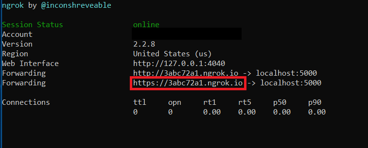
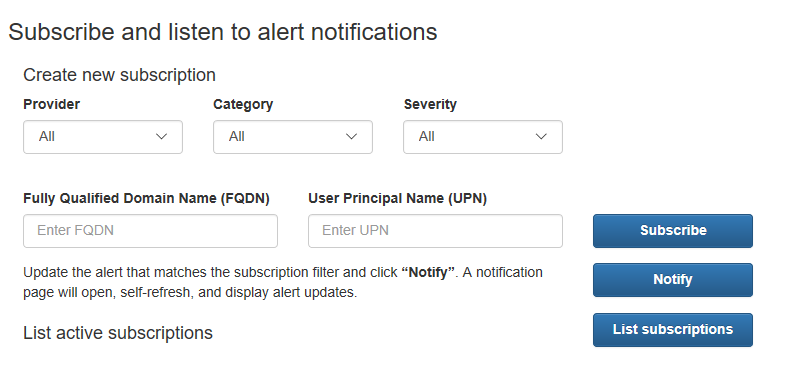

# Python Web App demo using Microsoft Intelligent Security Graph

 

Microsoft Graph provides REST APIs for integrating with Intelligent Security Graph providers that enable your app to retrieve alerts, update alert lifecycle properties, and easily email an alert notification. This sample consists of a Python web application that invokes common Microsoft Graph security API calls, using the [Requests](http://docs.python-requests.org/en/master/) HTTP library to call these Microsoft Graph APIs:

| API                 | Endpoint                                   |      |
| ------------------- | ------------------------------------------ | ---- |
| Get Alerts          | /security/alerts                           | [docs](https://developer.microsoft.com/en-us/graph/docs/api-reference/beta/resources/alert)  |
| Get user profile    | /me                                        | [docs](https://developer.microsoft.com/en-us/graph/docs/api-reference/v1.0/api/user_get) |
| Create a webhook subscription    | /subscriptions                                   | [docs](https://developer.microsoft.com/en-us/graph/docs/concepts/webhooks) |

For additional information about this sample, see [Get started with Microsoft Graph in a Python app](https://developer.microsoft.com/en-us/graph/docs/concepts/python
).

* [Prerequisites](#prerequisites)
* [Installation](#installation)
* [Running the sample](#running-the-sample)
* [Sendmail helper function](#sendmail-helper-function)
* [Contributing](#contributing)
* [Resources](#resources)

## Prerequisites

Before installing the sample:

* Install Python from [https://www.python.org/](https://www.python.org/). We've tested the code with Python 3.6, but any Python 3.x version should work. If your code base is running under Python 2.7, you may find it helpful to use the [3to2](https://pypi.python.org/pypi/3to2) tools to port the code to Python 2.7.
* To register your application for access to Microsoft Graph, you'll need either a [Microsoft account](https://www.outlook.com) or an [Office 365 for business account](https://msdn.microsoft.com/en-us/office/office365/howto/setup-development-environment#bk_Office365Account). If you don't have one of these, you can create a Microsoft account for free at [outlook.com](https://www.outlook.com).

## Installation

Follow these steps to install the samples:

1. Clone the repo, using one of these commands:
    * ```git clone https://github.com/microsoftgraph/python-security-rest-sample.git```

2. Create and activate a virtual environment (optional). If you're new to Python virtual environments, [Miniconda](https://conda.io/miniconda.html) is a great place to start.
3. In the root folder of your cloned repo, install the dependencies for the sample as listed in the ```requirements.txt``` file with this command: ```pip install -r requirements.txt```.

## Configuration

To configure the samples, you'll need to register a new application in the Microsoft [Application Registration Portal](https://apps.dev.microsoft.com/).

Follow these steps to register a new application:

1. Sign in to the [Application Registration Portal](https://apps.dev.microsoft.com/) using either your personal or work or school account.

2. Under **My applications**, choose **Add an app**. If you're using an Office 365 account and see two categories listed (Converged or Azure AD only), choose **Add an app** for the Converged applications section.

3. Enter an application name, and choose **Create**. (Do *not* choose **Guided Setup**.)

4. Next you'll see the registration page for your app. Copy and save the **Application Id** field.You will need it later to complete the configuration process.

5. Under **Application Secrets**, choose **Generate New Password**. A new password will be displayed in the **New password generated** dialog. Copy this password. You will need it later to complete the configuration process.

6. Under **Platforms**, choose **Add platform** > **Web**.

7. Under **Delegated Permissions**, add the permissions/scopes required for the sample. This sample requires **User.Read**, **SecurityEvents.Read.All**, and **SecurityEvents.ReadWrite.All** permissions.
    >**Note**: See the [Microsoft Graph permissions reference](https://developer.microsoft.com/en-us/graph/docs/concepts/permissions_reference) for more information about Graph's permission model.

8. Enter `http://localhost:5000/login/authorized` as the Redirect URL, and then choose **Save**.

Follow these steps to allow [webhooks](https://developer.microsoft.com/en-us/graph/docs/concepts/webhooks) to access the sample via a NGROK tunnel:

> **Note**: This is required if you want to test the sample Notification Listener on localhost. You must expose a public HTTPS endpoint to create a subscription and receive notifications from Microsoft Graph. While testing, you can use ngrok to temporarily allow messages from Microsoft Graph to tunnel to a localhost port on your computer.

1. Download [ngrok](https://ngrok.com/download).
2. Follow the installation instructions on the ngrok website.
3. Run ngrok, if you are using Windows. Run "ngrok.exe http 5000" to start ngrok and open a tunnel to your localhost port 5000.
4. Then update the `config.py` file with your ngrok url.

    

As the final step in configuring the sample, modify the ```config.py``` file in the root folder of your cloned repo, and follow the instructions to enter your Client ID and Client Secret (which are referred to as Application Id and Password in the app registration portal). Update the `notificationUrl` property in the ```config.py``` file to reflect your ngrok url. Then save the change. After you've completed these steps and have received [admin consent](#Get-Admin-consent-to-view-Security-data) for your app, you'll be able to run the ```sample.py``` sample as covered below.

## Get Admin consent to view Security data

1. Provide your Administrator your **Application Id** and the **Redirect URI** that you used in the previous steps. The organization’s Admin (or other user authorized to grant consent for organizational resources) is required to grant consent to the application.
2. As the tenant Admin for your organization, open a browser window and craft the following URL in the address bar:
https://login.microsoftonline.com/common/adminconsent?client_id=APPLICATION_ID&state=12345&redirect_uri=REDIRECT_URL
Where APPLICATION_ID is the application ID and REDIRECT_URL is the Redirect URL values from the App V2 registration portal after clicking on your application to view its properties.
3. After logging in, the tenant Admin will be presented with a dialog like the following (depending on which permissions the application is requesting):

   

4. When the tenant Admin agrees to this dialog, he/she is granting consent for all users of their organization to use this application.

## Running the sample

1. At the command prompt: ```python sample.py```
2. In your browser, navigate to [http://localhost:5000](http://localhost:5000)
3. Choose **Sign in with Microsoft** and authenticate with a Microsoft *.onmicrosoft.com identity.

A form that allows building a filtered alert query by selecting values from drop down menus:
-
By default, the top 5 alerts from each security API provider will be selected. But you can select to retrieve 1, 5, 10, or 20 alerts from each provider.

After you've selected your choices, click on **Get alerts**. A REST call will be sent to the Microsoft Graph, and a table with all the received alerts will be displayed below the form:


In the next section you'll see a "Manage Alerts" form where you can update lifecycle properties for a specific alert - by alert ID.
Once the alert is updated the metadata of the original alert is displayed above the updated alert.


Finally, the app allows webhook notifications to be sent from the Microsoft Graph to your sample application when an alert matching your webhook resource is updated. In order to view the webhook notifications, create a webhook subscription. Then click "Notify" to open another page that will display webhook notifications as they are pushed to your app.

   >**Note:** If you are running this sample on your local machine, then this section requires `ngrok` to properly create and receive notifications.



## Contributing

These samples are open source, released under the [MIT License](https://github.com/microsoftgraph/python-security-rest-sample/blob/master/LICENSE). Issues (including feature requests and/or questions about this sample) and [pull requests](https://github.com/microsoftgraph/python-security-rest-sample/pulls) are welcome. If there's another Python sample you'd like to see for Microsoft Graph, we're interested in that feedback as well &mdash; please log an [issue](https://github.com/microsoftgraph/python-security-rest-sample/issues) and let us know!

This project has adopted the [Microsoft Open Source Code of Conduct](https://opensource.microsoft.com/codeofconduct/). For more information, see the [Code of Conduct FAQ](https://opensource.microsoft.com/codeofconduct/faq/) or contact [opencode@microsoft.com](mailto:opencode@microsoft.com) with any additional questions or comments.

Your feedback is important to us. Connect with us on [Stack Overflow](https://stackoverflow.com/questions/tagged/microsoft-graph-security). Tag your questions with [Microsoft-Graph-Security].

## Resources

Documentation:

* [Use the Microsoft Graph to integrate with Security API](https://developer.microsoft.com/en-us/graph/docs/api-reference/beta/resources/security-api-overview)
* Microsoft Graph [List alerts](https://developer.microsoft.com/en-us/graph/docs/api-reference/beta/api/alert_list) documentation
* [Microsoft Graph permissions reference](https://developer.microsoft.com/en-us/graph/docs/concepts/permissions_reference)

Samples:

* [Python authentication samples for Microsoft Graph](https://github.com/microsoftgraph/python-sample-auth)
* [Sending mail via Microsoft Graph from Python](https://github.com/microsoftgraph/python-sample-send-mail)
* [Working with paginated Microsoft Graph responses in Python](https://github.com/microsoftgraph/python-sample-pagination)
* [Working with Graph open extensions in Python](https://github.com/microsoftgraph/python-sample-open-extensions)

Packages:

* [Flask-OAuthlib](https://flask-oauthlib.readthedocs.io/en/latest/)
* [Requests: HTTP for Humans](http://docs.python-requests.org/en/master/)

Copyright (c) 2018 Microsoft Corporation. All rights reserved.
